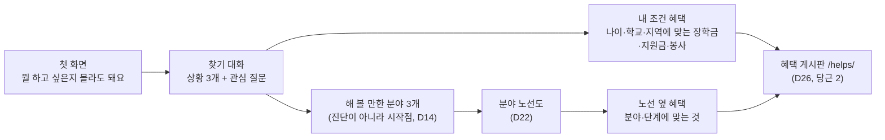
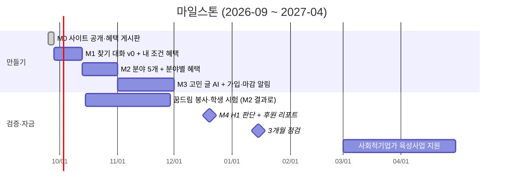

# 마일스톤: 고민에서 시작해 진로와 혜택까지

> 2026-09-27 작성 (D27). 큰 단계와 판단 지점은 `docs/roadmap.md`, MVP 범위는 `docs/mvp.md`. 이 문서는 **다음 6개월에 무엇을 언제까지 만들지**를 적는다.

## 그림: 사이트의 흐름 (D27)

- **당근 1**: 노선도 옆 혜택 (분야·단계에 맞는 것).
- **당근 2**: 드림스폰 같은 혜택 게시판 (장학금·지원금·봉사·체험 모음, 조회수 공개).
- 찾기 대화는 두 당근을 모두 채운다. **상황**(나이, 학교, 지역)으로 게시판을 거르고, **관심**으로 분야를 고른다.

## 먼저 정한 원칙

| 원칙 | 이유 |
|---|---|
| 분야가 5개가 되기 전에는 "추천"이라고 하지 않는다 | 분야가 1개면 모든 답이 요리사로 간다 |
| 혜택은 **상황으로 먼저**, 분야로는 규칙이 있는 것만 | 장학금·봉사 대부분은 분야와 상관없다. 상황 맞추기가 더 정확하다 |
| 적은 고민 글은 v0에서 **브라우저 밖으로 보내지 않는다** | 미성년자의 고민은 민감 정보. AI가 읽는 것은 처리방침·동의 뒤(M3) |
| 결과는 분야 **3개**, 한 줄 이유와 함께 | D14: 진단이 아니라 시작점 |

## 마일스톤

### M0 · 끝남 (2026-09-27)
- 사이트 공개 (GitHub Pages), 요리사 노선도, 혜택 게시판 284개, 매일 06:00 자동 수집, 조회수 공개.

### M1 · 찾기 대화 v0 (~2026-10-12)
만드는 것
- 첫 화면을 **"뭘 하고 싶은지 몰라도 돼요"**로 바꾸고 바로 대화 시작.
- 상황 3개(나이, 학교, 지역) → 관심 질문 8~10개(홀랜드 6유형을 가볍게, 고르기만) → **해 볼 만한 분야 3개**와 이유 한 줄.
- 결과 화면 오른쪽(휴대폰은 아래)에 **내 조건 혜택**: 게시판을 상황으로 거른 것, 마감 가까운 순.
- 분야가 아직 준비 중이면 솔직하게 "노선도 준비 중 · 먼저 이 혜택부터"로 보여 준다.
- 고민 한 줄 입력칸은 두되 **저장·전송 없음**, 결과 화면에 그대로 다시 보여 주기만.
- 답은 이 브라우저에만 저장(다시 오면 이어서).

완료 기준
- 390px 넘침 0, JS 없이도 게시판으로 갈 수 있다.
- 조회수에 대화 시작·완료 수를 이벤트로 센다(개인과 연결 안 됨).

### M2 · 분야 5개 + 분야별 혜택 (~2026-10-31)
만드는 것
- 분야 4개 추가 (요리사 포함 5개). 후보는 팀이 고른다. 예: 디자인·영상, IT·개발, 미용·뷰티, 돌봄·반려동물, 정비·기술. 기준은 학교 밖 청소년 실태조사의 희망 직업과 체험 가능성.
- 분야마다 길 3~4개, 역 6~8개 (요리사와 같은 형식, 사람이 확인).
- **분야별 혜택 규칙**: `config/attach-rules.json`에 분야마다 규칙 추가 → 게시판 항목에 분야 표시.
- 결과 공유 카드 (분야 3개 그림).

검증
- 꿈드림 봉사에서 학생 5~10명에게 직접 해 보게 하고 관찰 (검증 계획 방법 1).

### M3 · 고민 글 AI + 가입·마감 알림 (~2026-11-30)
먼저 할 것: 개인정보처리방침, 동의 화면 (active-work `privacy-policy`).
만드는 것
- 고민 글을 AI가 읽고 **질문을 골라 주기** (분야를 정해 주지 않는다). 글은 저장하지 않는다.
- 선택 가입(D11, 만 14세 이상): 결과·관심 혜택 저장.
- **마감 알림**: 저장한 혜택 마감 3일 전 알림 (카카오 채널 또는 이메일). 다시 찾아올 이유.

### M4 · H1 판단 + 후원 리포트 (2026-12-20)
- 인터뷰로 H1 판단 (`docs/validation-plan.md`).
- `/stats`와 GoatCounter 공개 통계판으로 후원 리포트 1장: 방문, 대화 완료, 혜택 원문 클릭.
- 첫걸음 지원(D21) 후원자 1곳과 시험 이야기 시작.

### 이후
- 2027-01-15 3개월 점검 (1,000명 판단, `docs/roadmap.md`).
- 2027-03~04 사회적기업가 육성사업 지원: 트래픽·학생 시험 결과를 근거로 (`docs/funding.md`).

## 숫자 목표 (예시, 팀이 확정)

| 시점 | 방문(월) | 찾기 대화 완료 | 혜택 원문 클릭 |
|---|---|---|---|
| M1 끝 | 300 | 50 | 30 |
| M2 끝 | 1,000 | 200 | 150 |
| M4 | 3,000 | 800 | 600 |
