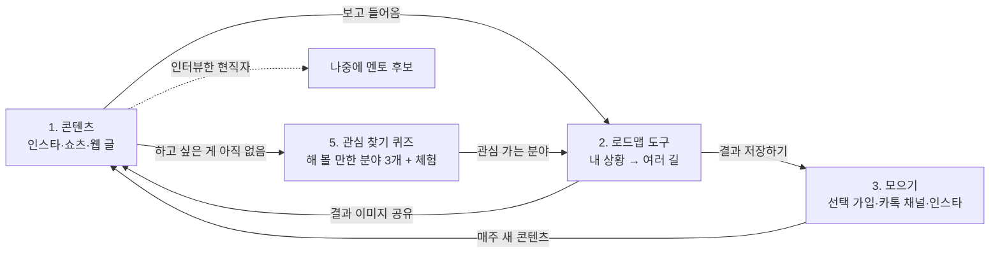

# MVP 설계: 지금 내 자리에서 시작하는 진로

> 작성일: 2026-09-25. 결정 기록 `decisions.md` D7.
> MVP의 1차 목표는 **사람을 모으는 것**이다. 멘토 연결은 사람이 충분히 모인 뒤에 붙인다.

## 왜 멘토 연결이 아니라 콘텐츠인가

- 멘토 연결은 학생과 멘토가 **둘 다** 있어야 돌아간다. 학생이 없으면 멘토가 올 이유가 없고, 멘토가 없으면 학생이 올 이유가 없다.
- 그래서 먼저 **학생이 찾아오고 머무를 이유(콘텐츠, 로드맵 도구)**를 만들고, 사람이 모이면 멘토를 붙인다.
- 콘텐츠를 만들며 인터뷰한 현직자가 **나중에 멘토 후보**가 된다. 두 쪽을 동시에 준비하는 셈이다.

## 한 줄 소개

> **지금 내 자리에서 시작하는 진로**

- 자퇴한 학생, 학교에 다니는 학생, 특성화고 학생 누구에게나 맞는다.
- **대학은 여러 길 중 하나로 똑같이 다룬다.** 검정고시를 보고 대학에 가는 것도 학교 밖 청소년이 많이 가는 길이다. "대학 없이"를 앞세우지 않는다.
- 어느 길이 낫다고 정해 주지 않는다. 여러 길을 **나란히** 보여 준다.

## 대상

- **가장 신경 쓰는 대상**: 학교 밖 청소년 (봉사 현장에서 만날 수 있고, 도움이 가장 절실하다)
- **콘텐츠가 닿는 범위**: 진로를 고민하는 모든 청소년, 그리고 부모님·선생님

## 제공하는 것: 커리큘럼이 아니라 '지도'

MVP는 **가르치는 내용(강의, 수업, 교재)을 만들지 않는다.** 대신 목표까지의 단계와, 단계마다 쓸 수 있는 도움을 한곳에 묶은 **지도**를 준다.

| 제공하는 것 | 예시 (요리사) |
|---|---|
| **길별 단계(마일스톤)** | 검정고시 → 조리기능사 → 현장 실습 / 조리학과 진학 / 직업훈련 |
| **단계별 지원** | 정부·지자체 지원, 장학금, 무료 강의·직업훈련 |
| **단계별 대회·활동** | 청소년 요리 대회, 체험 프로그램, 공모전 (포트폴리오가 된다) |
| **가볍게 해 보기 (체험)** | 원데이 쿠킹 클래스, 꿈길 진로체험, 청소년수련관 요리 프로그램 |
| **그 길을 간 사람 이야기** | 검정고시 후 조리학과에 간 사람, 바로 취업한 사람 |
| **이번 주 할 일 하나** | "올해 검정고시 접수 기간 확인하기" |

- 가르치는 내용이 필요하면 **이미 있는 곳으로 연결한다** (EBS, 무료 검정고시 강의, 직업훈련기관 등).
- 커리큘럼을 만들지 않는 이유: 만드는 데 시간과 전문성이 많이 들고, 이미 좋은 것이 많아 차별점이 안 된다. 우리의 강점은 **흩어진 정보를 하나의 길로 묶는 것**이다.
- 예외: **꿈드림 봉사 수업안**("AI와 함께 내 진로 로드맵 만들기")은 직접 만든다. 학생에게 주는 것이 아니라 **선생님이 진행할 수 있는 수업안**이며, 나중에 선생님용 수업 키트로 발전할 수 있다.

## 구성

> 화면 흐름과 디자인 방향은 D22를 따른다: **대화로 시작 → 지하철 노선도 지도 → 혜택이 자동으로 옆에**. 시안은 `/concepts/combo`.



### 1. 콘텐츠 (들어오는 입구)

수동적인 학생도 **그냥 흘려보다가** 닿을 수 있게 만든다. 콘텐츠 하나를 **인스타 카드뉴스, 쇼츠·릴스, 웹 글** 세 가지로 나눠 올린다.

| 종류 | 예시 | 주로 올릴 곳 |
|---|---|---|
| 직업별 여러 길 | 요리사가 되는 여러 길: 조리학과 진학, 자격증, 직업훈련, 현장 취업 비교 | 인스타 카드뉴스, 웹 글 |
| 여러 길을 간 사람 이야기 | 검정고시 → 대학 간 사람, 바로 취업한 사람, 훈련기관을 거친 사람 | 쇼츠·릴스, 웹 글 |
| 상황별 선택지 | 자퇴 후 선택지 한눈에 보기 | 웹 글 (검색 유입) |
| 부모님·선생님용 | 진로를 고민하는 아이와 이야기하는 법 | 웹 글 |

### 2. 로드맵 도구 (다시 찾아올 이유)

- 질문 5개(관심 분야, 지금 상황, 나이, 지역, 쓸 수 있는 시간)에 답하면 → **갈 수 있는 여러 길 + 이번 주에 할 일 1개 + 단계별로 받을 수 있는 지원과 나갈 수 있는 대회·활동**을 보여 준다.
- **가입 없이도 쓴다.** 가입하면 결과를 저장하고 다음에 다시 볼 수 있다. 가입하지 않으면 답한 내용을 저장하지 않는다.
- 결과를 **이미지로 저장·공유**할 수 있게 한다.
- **v0는 AI 없이** 만든다. 분야 5개 정도의 로드맵을 손으로 만들어 두고, 답에 따라 골라 보여 준다. 싸고 안전하고, 어떤 분야를 많이 고르는지부터 알 수 있다.
- **v1에서 AI를 붙인다.** 원칙은 README의 AI 원칙을 따른다. 대신 정해 주지 않고, 위기 신호가 보이면 도움받을 곳(청소년상담 1388 등)을 안내한다. AI 사용료가 생기므로 시작 전에 팀이 비용을 정한다.

### 3. 모으기: 선택 가입 + 구독 (D11)

**가입은 v0부터 넣는다. 다만 선택이다.** 콘텐츠와 로드맵 도구는 가입하지 않아도 쓴다. "먼저 써 보고, 저장하고 싶으면 가입"을 앞에 둔다.

| 항목 | 내용 |
|---|---|
| **누가** | **학생 트랙: 만 14~24세** (D13). 만 14세 미만은 보호자 동의가 필요해 MVP에서는 받지 않는다. 24세는 학교 밖 청소년의 법정 범위(9~24세)와 꿈드림 대상에 맞춘 것이다 |
| **어른** | 부모님·선생님·멘토는 **어른 트랙으로 v1에 따로** 만든다. 학생과 같은 공간에 섞지 않고, 멘토는 신원을 확인한다 |
| **모으는 것** | 닉네임, 나이대(생년월일 아님), 지역(시·도), 관심 분야, 저장한 로드맵 |
| **모으지 않는 것** | 실명, 학교 이름, 전화번호, 상세 주소 |
| **가입하면 좋은 점** | 로드맵 저장·다시 보기, 관심 분야의 지원·대회 알림 |
| **꼭 필요한 것** | 개인정보처리방침(모으는 항목, 이유, 보관 기간), 탈퇴하면 바로 삭제, 기본 보안 |

- 가입자와 **카카오톡 채널 친구 + 인스타 팔로워**를 '모인 사람'으로 센다. 매주 새 콘텐츠를 보낸다.
- 데이터를 많이 가질수록 유출 책임이 커진다. **서비스에 꼭 필요한 것만** 모은다.
- 모인 데이터는 개인을 알 수 없게 합친 **통계**로만 활용한다 (D10).

### 4. 고민 Q&A (커뮤니티의 첫 단계, D12)

- 학생이 **익명으로 고민을 보내면**, 팀과 여러 길을 간 현직자가 답을 달아 **콘텐츠로 공개**한다.
- 자유 댓글이 아니라 **확인된 사람이 답하는 Q&A**다. 관리할 수 있고, 답하는 현직자가 **멘토 후보**가 되며, 아무도 답하지 않는 빈 게시판 문제가 없다.
- 처음에는 인스타 질문 스티커나 카톡 채널로 받는다. 사이트 게시판은 반응을 본 뒤 만든다.
- **또래끼리 댓글**은 사람이 모인 뒤 안전장치와 함께 연다: 올리기 전 확인 또는 신고, **개인 메시지 기능 없음**, 연락처·SNS 계정 공유 차단, 위기 표현이 보이면 청소년상담 1388 안내와 팀 알림, 어른과 학생 계정 분리.

### 5. 관심 찾기 퀴즈 + 체험 (D14)

진로를 정하지 못한 학생(학교 밖 청소년 3명 중 1명)에게 "뭘 하고 싶어?"는 가장 어려운 질문이다. 퀴즈로 **시작점**을 주고, 체험으로 **직접 해 보게** 한다.

```
하고 싶은 게 있어요?
 ├─ 네 → 로드맵 도구
 └─ 아직 모르겠어요 → 관심 찾기 퀴즈 (10문항: 좋아하는 것, 싫어하는 것, 끌리는 활동)
                      → 해 볼 만한 분야 3개
                      → 분야마다 '가볍게 해 보기' 체험 1~2개
                      → 관심 가는 분야의 로드맵
```

- **진단이 아니다.** "너에게 맞는 직업"이 아니라 **"해 볼 만한 분야 3개"**를 보여 준다. 유형으로 정해 주지 않는다 (D6의 AI 원칙과 같다: 대신 정하지 않는다).
- **MBTI가 아니라 검증된 흥미 모델**(홀랜드 6가지 흥미 유형)을 바탕으로 가볍게 만든다. MBTI처럼 재미있고 공유하기 좋게 만들되, 결과 문구는 "○○형이니까 ○○를 해라"가 아니라 "이런 걸 좋아하는 사람들이 해 보는 분야"로 쓴다.
- **공식 검사는 만들지 않는다.** 제대로 된 적성·흥미 검사를 원하면 **커리어넷의 무료 진로심리검사로 연결**한다.
- **체험**: 꿈길 진로체험, 청소년수련관 프로그램, 직업체험관(잡월드 등), 원데이 클래스, 꿈드림 프로그램, 대회. "해 봐야 안다"는 것을 지도(D8)의 한 단계로 넣는다.
- **v0 범위**: 퀴즈 10문항, 로드맵과 같은 분야 5개, 체험은 분야마다 2개씩 손으로 모은다.
- 결과를 **이미지로 공유**할 수 있게 한다. 가입하면 결과를 저장한다 (D11).

## 들어오는 길

학생 대부분은 스스로 찾아오지 않는다고 보고, **찾아가는 길**을 중심에 둔다.

1. **봉사 수업**: "AI와 함께 내 진로 로드맵 만들기" → 수업에서 도구를 써 보고 → 채널 추가
2. **센터 선생님**: 콘텐츠와 도구를 학생들에게 공유
3. **인스타·쇼츠**: 추천 피드에 뜨는 콘텐츠
4. **검색**: 상황별 글 (구글 서치 콘솔, 네이버 서치어드바이저 등록)

## 첫 콘텐츠 주제 10개

| # | 주제 | 종류 | 메모 |
|---|---|---|---|
| 1 | 자퇴 후 선택지 한눈에 보기: 검정고시 → 대학, 자격증, 직업훈련, 복학 | 상황별 | 첫 글. 검색 유입의 중심 |
| 2 | 검정고시, 어떻게 준비하나: 일정, 과목, 무료로 공부할 수 있는 곳 | 상황별 | 일정은 매년 공식 공고로 확인 |
| 3 | 검정고시 후 대학 가는 길 | 상황별 | 전형은 대학마다 달라 공식 자료로 확인 |
| 4 | 진로가 아직 없어도 괜찮아: 관심사 찾는 작은 방법 | 상황별 | 막막한 학생용. 관심 찾기 퀴즈로 연결 |
| 5 | 요리사가 되는 여러 길 | 직업별 | 학과, 자격증, 훈련, 현장 취업 |
| 6 | 개발자가 되는 여러 길 | 직업별 | 학과, 특성화고, 교육 과정, 독학 |
| 7 | 미용·뷰티 분야로 가는 여러 길 | 직업별 | 자격증, 학과, 현장 취업 |
| 8 | 여러 길을 간 사람들 1: 검정고시 → 대학 | 사람 이야기 | 인터뷰이는 멘토 후보로 기록 |
| 9 | 청소년이 받을 수 있는 교육·자격증·훈련 지원, 나갈 수 있는 대회·활동 한눈에 | 지원 정보 | 원문 링크, 마감일, 확인 날짜 필수 |
| 10 | 부모님·선생님용: 진로를 고민하는 아이와 이야기하는 법 | 어른용 | 어른 유입 확인용 |

## 주간 운영 (3명 기준, 초안)

| 역할 | 하는 일 | 주당 시간 |
|---|---|---|
| A: 기획·글 | 주제 정하기, 웹 글 쓰기, 검색어 확인 | 3~4시간 |
| B: 디자인·SNS | 카드뉴스, 쇼츠·릴스, 인스타·카톡 채널 올리기 | 3~4시간 |
| C: 사실 확인·인터뷰·도구 | 공식 자료로 사실 확인, 사람 인터뷰, 로드맵 도구·퀴즈·체험 정보 관리 | 3~4시간 |

- **주 2개 콘텐츠**를 목표로 한다. 하나를 세 가지 형식으로 나눠 올린다.
- 방학 중 인원이 줄면 주 1개로 줄이고, 미리 만들어 둔 콘텐츠를 예약 발행한다.

## 콘텐츠 원칙

- **사실은 공식 자료로 확인하고, 확인한 날짜와 원문 링크를 적는다.** 검정고시 일정, 전형, 지원 조건은 해마다 바뀐다.
- 어느 길이 더 낫다고 말하지 않는다. 장단점을 나란히 보여 준다.
- 사람 이야기는 본인 동의를 받고, 미성년자는 보호자 동의도 받는다. 알아볼 수 있는 정보는 본인이 원하는 만큼만 쓴다.
- 자극적인 제목("자퇴해도 성공한다")을 쓰지 않는다.

## 측정

| 단계 | 지표 | 도구 |
|---|---|---|
| 닿았나 | 콘텐츠 조회수, 검색 노출 수 | 인스타 인사이트, 서치 콘솔 |
| 들어왔나 | 사이트 방문, 도구 사용 수 | 개인을 알아볼 수 없는 방문 통계 |
| 퍼졌나 | 로드맵·퀴즈 결과 공유 수 | 공유 버튼 클릭 수 |
| 해 봤나 | 퀴즈 뒤 체험 정보를 누른 수 | 체험 링크 클릭 수 |
| **남았나 (가장 중요)** | 가입자 + 카톡 채널 친구 + 인스타 팔로워, 다시 찾아온 비율 | 사이트·채널·인스타 통계 |

또 **누가 모이는지**(학교 밖 청소년인지, 재학생인지, 부모님·선생님인지)를 봉사 현장과 채널 설문으로 확인한다.

## 다음 단계로 넘어가는 기준 (예시, 결과를 보기 전에 팀이 확정)

| 기준 | 넘어가면 |
|---|---|
| 가입자 + 카톡 채널 친구 + 인스타 팔로워 **1,000명** | 멘토 연결 소규모 시험 (센터 선생님을 통해 5~10쌍) |
| 로드맵 도구에서 가장 많이 고른 분야 3개 | 그 분야 현직자부터 멘토로 모집 |
| 3개월 동안 반응이 거의 없음 | 주제, 형식, 채널을 다시 검토 |

## 이후 단계: 나의 기록 (포트폴리오, D15)

로드맵 단계를 해낼 때마다 기록이 쌓이고, 나중에는 이력서 초안과 추천으로 이어지는 기능이다. **MVP(v0)에는 넣지 않는다.**

**왜 하나**
- **행동의 증거가 쌓인다.** "대화·로드맵 뒤 실제로 행동하나"(H2)가 데이터로 남고, "학생 N명이 로드맵 M단계를 실행했다"는 임팩트 숫자가 된다.
- **나의 성장을 보는 것이 먼저, 제출용은 덤이다.** 학교를 그만두면 생활기록부처럼 활동을 쌓아 주는 기록이 끊긴다(가설). "내가 이만큼 했다"는 자기효능감이 가장 큰 가치일 수 있다.
- 기록이 쌓이면 쉽게 떠나지 않는다. 콘텐츠는 따라 할 수 있어도 사람의 기록은 따라 할 수 없다.

**이미 있는 것과 다른 점** (조사 2026-09-25, `competitors.md`)
- e청소년 청소년수련활동인증제는 인증 프로그램의 참여 기록확인서와 포트폴리오(소감·사진)를 이미 제공한다. 커리어넷 커리어플래너도 진로·학습활동을 기록한다.
- 우리의 차별점: **인증 프로그램 밖의 활동**(알바, 독학, 온라인 강의, 원데이 클래스)까지 담고, **로드맵 단계와 연결**하고, **이력서 초안과 멘토 추천**으로 이어진다.

**단계**

| 단계 | 내용 | 시기 |
|---|---|---|
| 1. 나의 기록 | 로드맵 단계마다 **"해냈어요"** 버튼, 한 줄 후기, 사진이나 증빙(선택). **기본 비공개** | v1 (가입 뒤) |
| 2. 이력서 초안 | 쌓인 기록으로 AI가 **초안**을 쓰고 학생이 고쳐서 PDF로 내보낸다. 기록에 없는 것은 쓰지 않는다 | v1.x |
| 3. 확인 표시 | **본인 작성 / 증빙 첨부 / 발급 기관 확인**으로 나눠 보여 준다 | 협력 기관이 생긴 뒤 |
| 4. 추천서 | 학생을 **실제로 아는 멘토나 센터 선생님**이 쓴다. 플랫폼이 아니라 사람이 추천한다 | 멘토 연결 뒤 |

**원칙**
- **보증을 새로 만들지 않고, 이미 믿을 만한 곳이 발급한 것을 빌려 온다.** e청소년 기록확인서, 수료증, 오픈배지, 대회 주최 측 수상 확인 같은 증빙을 첨부·표시한다. "확인됨"은 **누가, 무엇을, 언제 확인했는지**와 함께 보여 준다.
- 공공기관 명의·로고처럼 보이는 문서를 만들지 않는다. "확인됨"·추천 표시가 법적으로 문제없는지는 **전문가 확인 후** 연다.
- 사진은 개인정보다. 기본 비공개, 학생이 골라서 공유, 요청하면 바로 삭제·검색 제외한다. 기업에 넘기지 않고 **학생이 직접 보낸다** (D10).
- 수동적인 학생도 쓰게 **사진 하나, 한 줄이면 끝나게** 만들고, "이번 주에 해낸 것 기록할래요?" 알림을 보낸다.
- 새 가치 후보: 교육청의 **학교 밖 청소년 학습경험 학력인정**(초·중 단계)에 필요한 학습 증빙을 모으는 데 도움이 될 수 있다. 인터뷰로 확인한다.

**v1에서 볼 숫자**: "해냈어요"를 누른 학생 수와 단계 수. 이것이 H2의 검증 지표가 된다.

## MVP에서 하지 않는 것

- 멘토 연결 기능, 멘토와의 대화 기록
- 또래끼리 자유 댓글 (Q&A로 먼저 시작)
- 만 14세 미만 가입
- 지원 정보 자동 수집 (도구에 쓸 지원 정보와 대회·활동은 손으로 30~50개)
- 강의·교재 같은 커리큘럼 제작 (이미 있는 곳으로 연결)
- 공식 적성·흥미 검사 제작, 유형 판정 (커리어넷으로 연결)
- 나의 기록·이력서·추천서 (v1 이후, D15)

## 위험

- **콘텐츠는 꾸준함 싸움이다.** 몇 달 동안 계속 올려야 반응이 오는 경우가 많다. 운영표의 양을 지킬 수 있는지 첫 4주에 확인한다.
- **모인 사람이 학교 밖 청소년이 아닐 수 있다.** 괜찮지만 계속 확인한다.
- 팔로워가 많아도 **멘토 연결에 돈을 낼 곳(기업·기관)**이 있는지는 따로 확인해야 한다 (검증 계획 H8).
