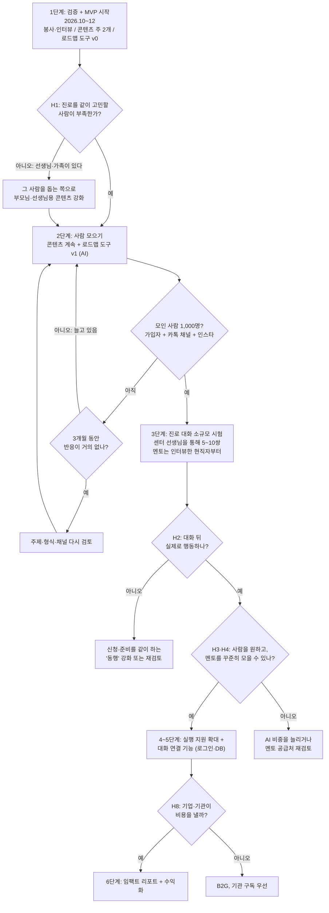
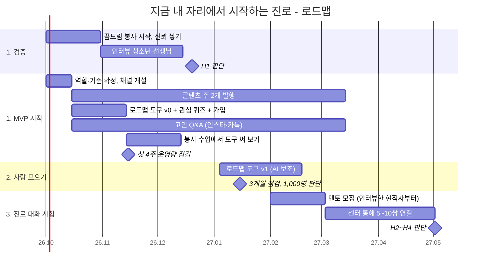
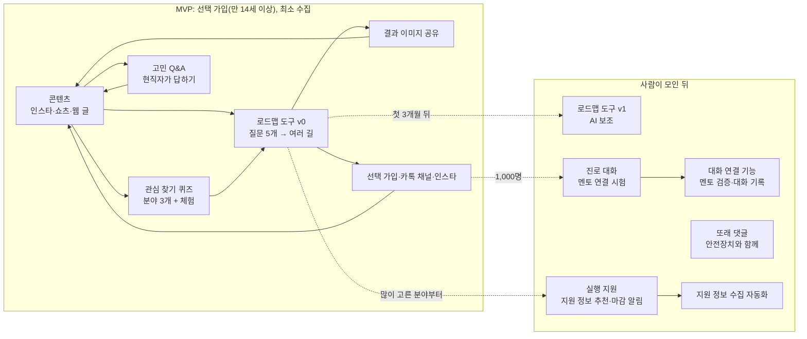

# 기획 로드맵

> 작성일: 2026-09-25. 방향은 `decisions.md` D6(사람 중심 진로 대화 + AI 보조)과 D7(콘텐츠 MVP로 사람 먼저 모으기)을 따른다.
> 원칙은 **검증과 사람 모으기를 동시에 → 사람이 모이면 멘토 → 필요한 것만 자동화**다. 가설 번호는 [검증 계획](validation-plan.md), MVP 내용은 [MVP 설계](mvp.md)를 따른다.

## 1. 단계와 판단 지점

인터뷰(검증)와 콘텐츠(사람 모으기)를 같은 시기에 돌리고, 두 결과를 함께 보고 다음 단계로 간다.

## 2. 일정

날짜는 목표다. 봉사 일정과 인터뷰 결과에 따라 조정한다.

## 3. MVP 범위

MVP는 **사람을 모으는 데 필요한 것만** 만든다. 가입은 v0부터 선택으로 두고(만 14세 이상), 멘토 연결과 또래 댓글은 사람이 모인 뒤다.

## 원칙

1. **판단 기준을 결과보다 먼저 적는다.** 1,000명, H1 기준 수치 같은 숫자는 결과를 보기 전에 `decisions.md`에 확정한다.
2. **검증과 사람 모으기를 동시에 한다.** 검색 노출은 자리 잡는 데 시간이 걸리므로, 인터뷰 결과를 기다리지 않고 콘텐츠를 시작한다.
3. **찾아가는 길을 중심에 둔다.** 학생 대부분은 스스로 찾아오지 않는다. 봉사 수업과 센터 선생님이 첫 입구다.
4. **자동화는 가장 나중에 한다.** 멘토 연결은 사람이 직접, 지원 정보는 손으로 먼저 해 보고, 손으로 하기 힘들어질 때 기능으로 만든다.
