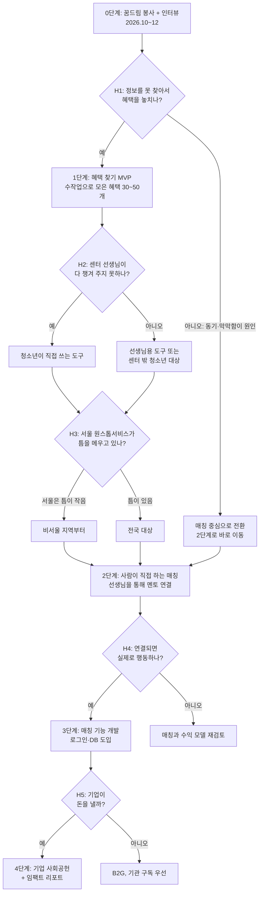
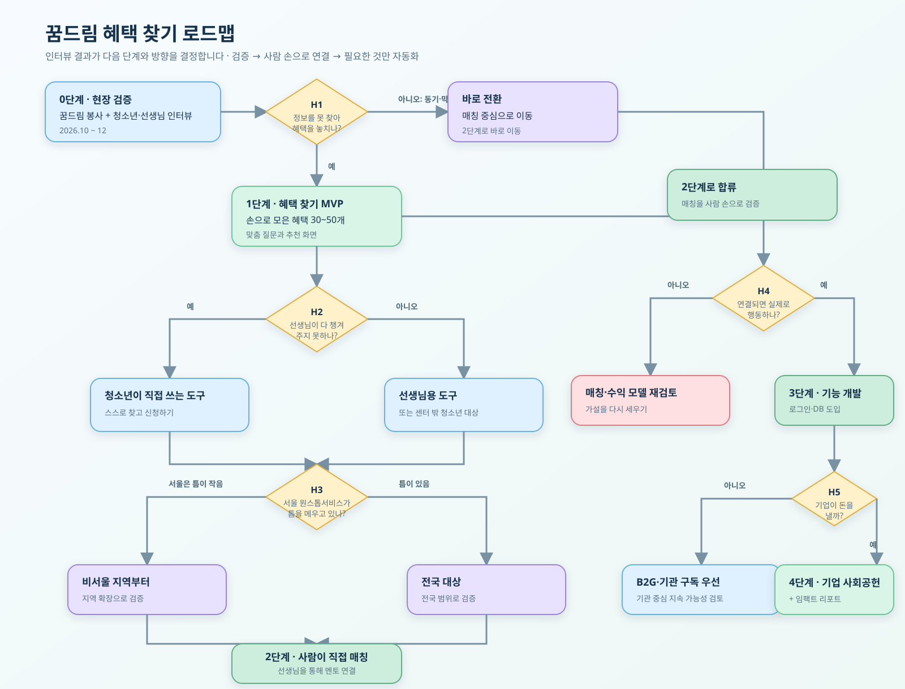
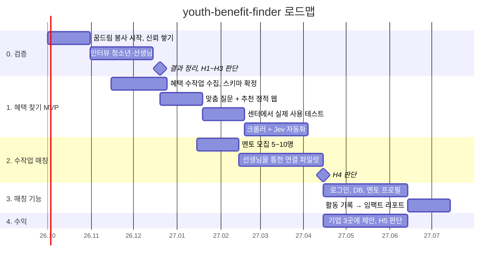
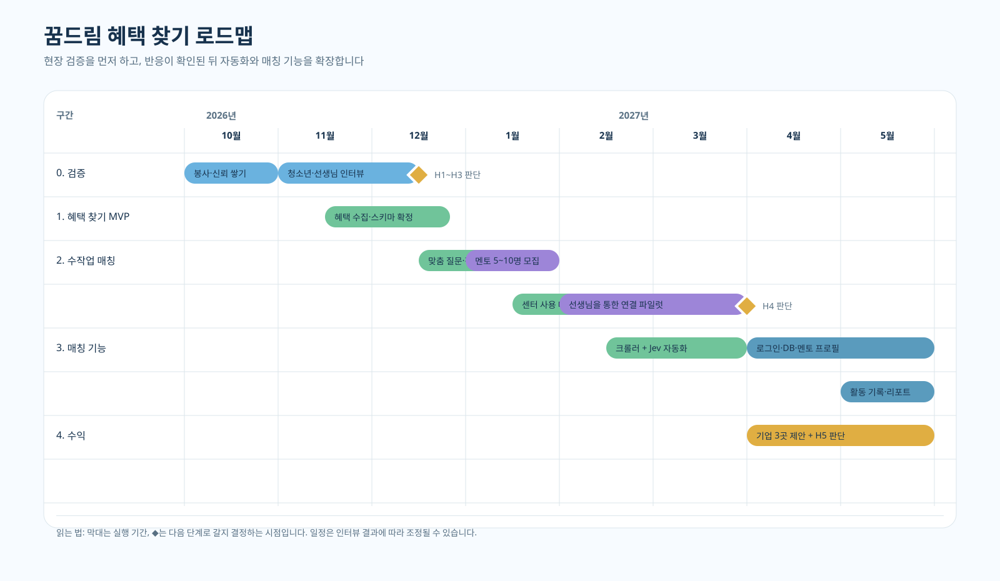
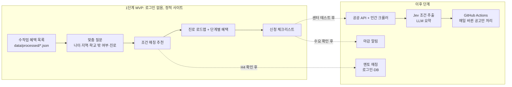
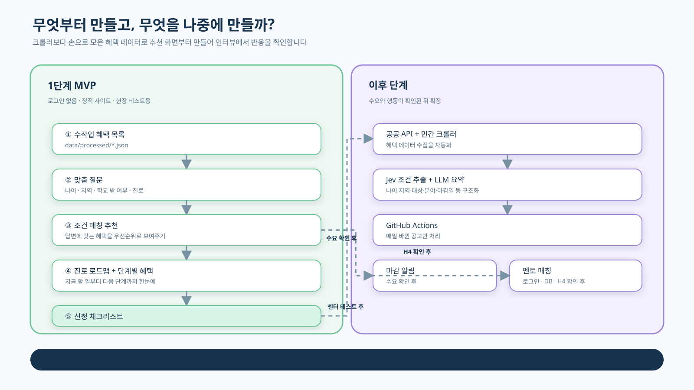

# 기획 로드맵

> 작성일: 2026-09-25. 원칙은 **검증 → 사람 손으로 연결 → 필요한 것만 자동화**다.
> 문제는 아직 가설이므로, 코드보다 인터뷰 결과가 먼저 방향을 정한다. → [검증 계획](validation-plan.md)

## 1. 단계와 판단 지점

인터뷰 결과에 따라 갈라지는 지점을 미리 정해 둔다.

## 2. 일정

## 3. MVP 범위와 이후 범위

크롤러보다 **손으로 모은 혜택 데이터로 추천 화면부터** 만든다. 인터뷰에서 바로 보여 주고 반응을 볼 수 있다.

## 원칙

1. **판단 기준을 미리 적는다.** 예: "인터뷰 15명 중 8명 이상이 '나중에 알고 놓쳤다'고 하면 H1 지지". 결과를 본 뒤 기준을 정하면 원하는 쪽으로 해석하게 된다.
2. **혜택 수집은 인터뷰와 동시에 시작한다.** 손으로 정리해 보면 Jev로 뽑을 필드(나이, 지역, 대상, 분야, 마감일)가 충분한지 알 수 있다.
3. **멘토 매칭은 스프레드시트와 카톡으로 시작한다.** H4 확인 전에 로그인과 DB를 만들면 버려질 가능성이 크다.
4. **크롤러는 가장 나중에 만든다.** 사람이 손으로 하기 힘들어졌을 때 만들어도 늦지 않다.
